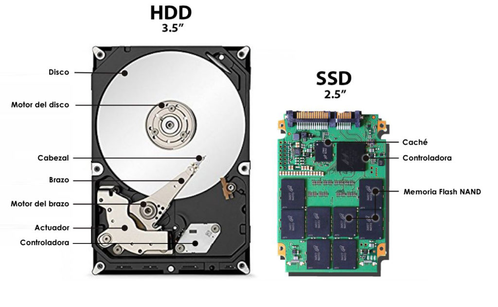
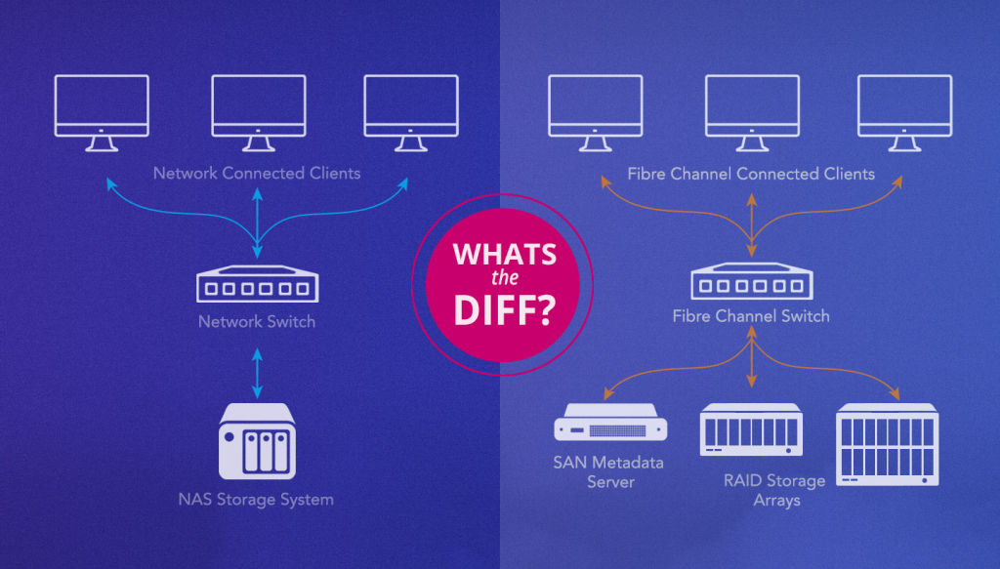

# Tipos de Almacenamiento

| Tipo de Almacenamiento      | Forma de Conexión                     | Tasa de Transferencia                  | Descripción                                                      |
|-----------------------------|---------------------------------------|----------------------------------------|------------------------------------------------------------------|
| HDD (Disco Duro Mecánico)   | IDE, SATA, USB                        | 80-160 MB/s (SATA)                    | Almacenamiento magnético, lento y con gran capacidad.            |
| SSD (Unidad de Estado Sólido) | SATA, M.2, USB                        | 200-600 MB/s (SATA), 1-5 GB/s (NVMe) | Almacenamiento rápido basado en memoria flash.                   |
| SSHD (Unidad de Estado Sólido Híbrida) | SATA, M.2                            | 80-160 MB/s (SATA)                    | Combina HDD y SSD para velocidad y capacidad.                   |
| Almacenamiento en la Nube    | Internet (protocolo TCP/IP)          | Variable (depende de la conexión)     | Datos en servidores remotos accesibles por Internet.             |
| NAS (Almacenamiento Conectado a la Red) | Red (protocolo TCP/IP)                | 1 Gbps (Gigabit Ethernet)             | Dispositivo accesible en una red local.                         |
| SAN (Red de Área de Almacenamiento) | Fiber Channel, iSCSI                 | 2-32 Gbps (Fiber Channel)             | Red dedicada para almacenamiento consolidado.                    |
| Almacenamiento Portátil      | USB, eSATA                           | 5-40 Gbps (USB 3.0/3.1/3.2, eSATA)    | Dispositivos externos transportables.                            |

# Tipos de Conectores para Discos Duros en una PC

| Tipo de Conector   | Lanzamiento | Tasa Máxima de Transferencia   | Descripción                                                    |
|--------------------|-------------|--------------------------------|----------------------------------------------------------------|
| eSATA              | 2004        | 6 Gbps / 0.75 GB/s             | Versión externa de SATA, permite la conexión de discos duros externos. |
| SATA III           | 2009        | 6 Gbps / 0.75 GB/s             | La versión más común en uso, adecuada para la mayoría de SSDs.  |
| M.2 SATA           | 2009        | 6 Gbps / 0.75 GB/s             | Utiliza el protocolo SATA en un formato compacto.               |
| M.2 NVMe           | 2013        | 32 Gbps / 4 GB/s               | Alta velocidad usando la interfaz NVMe sobre PCIe.              |
| PCIe 3.0           | 2010        | 32 Gbps / 4 GB/s               | Conexión rápida para dispositivos como SSDs; hasta 32 Gbps en 4 carriles. |
| PCIe 4.0           | 2017        | 64 Gbps / 8 GB/s               | Mejora en velocidad de transferencia en comparación con PCIe 3.0. |
| PCIe 5.0           | 2019        | 128 Gbps / 16 GB/s             | Velocidades aún más rápidas, usado en dispositivos de última generación. |
| SAS                | 2004        | 12 Gbps / 1.5 GB/s             | Conector de alta velocidad, utilizado en entornos empresariales. |
| USB 2.0            | 2000        | 0.48 Gbps / 0.06 GB/s          | Conector común para discos externos, velocidad limitada.        |
| USB 3.0            | 2008        | 5 Gbps / 0.625 GB/s            | Conector más rápido para discos externos, adecuado para la mayoría de usuarios. |
| USB 3.1            | 2013        | 10 Gbps / 1.25 GB/s            | Mejora la velocidad en comparación con USB 3.0.                 |
| USB 3.2            | 2017        | 20 Gbps / 2.5 GB/s             | Aumenta la capacidad de transferencia, adecuado para dispositivos de alta velocidad. |
| USB 4.0            | 2019        | 40 Gbps / 5 GB/s               | Alta velocidad, utilizado principalmente en dispositivos modernos. |
| Thunderbolt 3      | 2015        | 40 Gbps / 5 GB/s               | Alta velocidad, usado en dispositivos externos, especialmente en Apple. |
| Thunderbolt 4      | 2020        | 40 Gbps / 5 GB/s               | Similar a Thunderbolt 3, pero con mayor estabilidad y funcionalidad. |

> **Nota:** La tasa de transferencia se expresa en Gbps (Gigabits por segundo) y GB/s (Gigabytes por segundo). 
> Para convertir Gbps a GB/s, se divide la velocidad en Gbps por 8, ya que 1 byte = 8 bits. Por ejemplo, 40 Gbps es equivalente a 5 GB/s.

## HDD vs SSD

<table>
   <tr>
      <td></td>
   </tr>
</table>

## NAS vs SAN

<table>
   <tr>
      <td></td>
   </tr>
</table>

## Material Extra

- PCIe [video](https://www.youtube.com/watch?v=Fj7F7Qs9-us)

