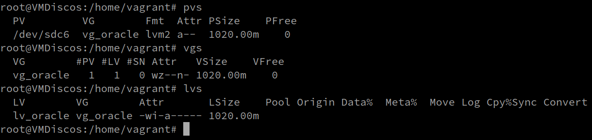

# Machete LVM

> La idea de este documento es tener una ayuda memoria Con los pasos a seguir </br>
> Para Trabajar con LVM </br>


- [X] **Creacion y Agrandar**
> Supongamos que agregamos un disco rigido y el mismo es reconocido por el sistema como "sdb" </br>

 ```sh
#1. Agregar disco... crear particio 8e en el disco nuevo (fdisk)
#2. Crear particion disco tipo lvm (8e) 
fdisk /dev/sdb
#2.1 Limpiar mugre del disco... sobre todo en virtuales
wipefs -a /dev/sdb1

#3. crear el pv
pvcreate /dev/sdb1

#4. crear vg
vgcreate vg_oracle /dev/sdb1
	#4 Bis. Si ya existe  ->  agregar el pv en el vg
	vgextend vg_oracle /dev/sdb1

#5. Crear lv 
lvcreate -l +100%FREE  vg_oracle -n lv_oracle
	#5 Bis. Si ya existe  ->  extender lv
	lvextend -l +100%FREE /dev/mapper/vg_oracle-lv_oracle   # Puedo usar un %
	lvextend -L +1G /dev/mapper/vg_oracle-lv_oracle         # o Puedo indicar un Tamaño

#6. crear el fs 
mkfs.ext4 /dev/mapper/vg_oracle-lv_oracle
	#6 Bis. Si ya existe  ->  agrandar fs (si el fs es xfs usar xfs_growfs)
	resize2fs /dev/mapper/vg_oracle-lv_oracle

#7. Montar Normalmente
sudo mount /dev/mapper/vg_oracle-lv_oracle /DB_Oracle
```


- [ ] **Achicar lv y fileSystem**
> Supongamos que Necesitamos achicar el home </br>

```sh
# 1. Desmonto el lv
umount /home/

# 2. chekear Errores y repara
e2fsck -f /dev/mapper/vg_hdd-lv_home

# 3. Achicar el File System
resize2fs /dev/mapper/vg_hdd-lv_home  30G

# 4. Reducir el logical volume
lvreduce -L 30G /dev/mapper/vg_hdd-lv_home

# 5. chekear Errores y repara
e2fsck -f /dev/mapper/vg_hdd-lv_home

# 6. Volver a Montar
mount /home/
```


- [ ] **Quitar un disco**

> Como podemos ver en la imagen Tenemos:</br>
> El pv que utiliza la particion `/dev/sdc6` </br>
> El VG `vg_oracle`  que esta compuesto por el PV `/dev/sdc6` </br>
> El LV `lv_oracle`  que pertenece al VG `vg_oracle` </br>
> Dicho LV esta Montado y siendo utilizado (sin persistencia)</br>
> Necesitamos Eliminar los pv,vg y lv para tener el sistema limpio..</br>
<div>
<table>
   <tr>
      <td></td>
   </tr>
</table>
</div>

```sh
# 1. Desmonto el lv (Si estuviera montado de forma persistente eliminar la linea en /etc/fstab)
umount /dev/mapper/vg_oracle-lv_oracle

# 2. Elimino el lv
lvremove /dev/mapper/vg_oracle-lv_oracle

# 3. Elimino el vg (No debe tener lv)
vgremove vg_oracle

# 4. Elimino el pv
pvremove /dev/sdc6

# En este punto si ejecuto un 
sudo pvs; sudo vgs; sudo lvs
# No deberia de ver rastros de ningun pv del disco a quitar..

# Recien aca se puede quitar el disco del host.. o reparticionar para reutilizar en lo que se desee.
```