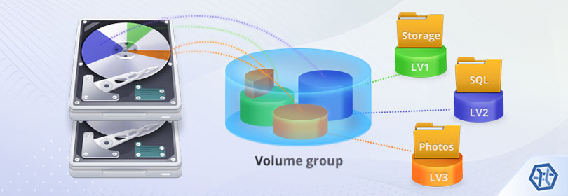
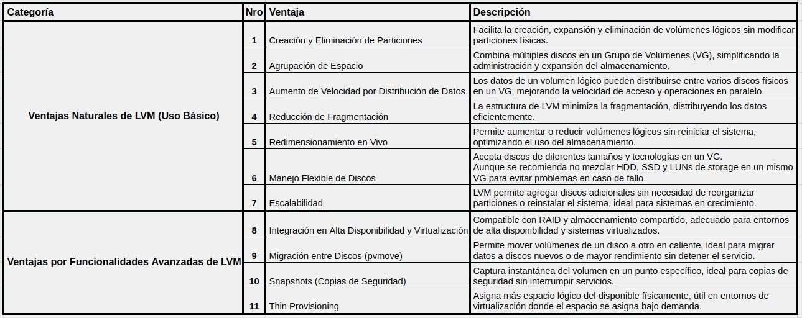
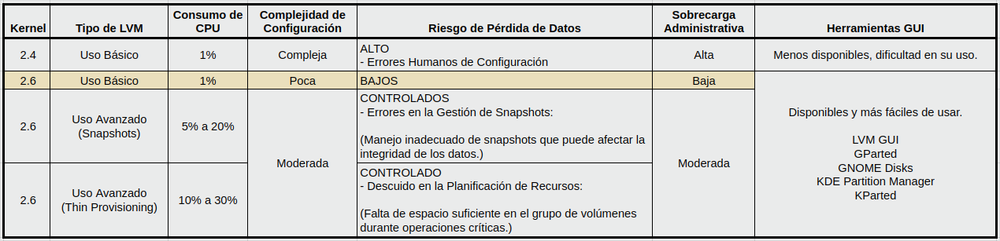

# LVM (Logical Volume Manager)

## ¿Qué es LVM?
LVM es una tecnología de gestión de almacenamiento para sistemas Linux. Permite a los administradores crear, redimensionar y mover particiones de manera flexible sin necesidad de desmontar sistemas de archivos o reiniciar el sistema.

## Conceptos Clave
- **Physical Volume (PV)**: Un disco físico o una partición que se utiliza en LVM.
- **Volume Group (VG)**: Un grupo de volúmenes físicos que actúan como una única unidad de almacenamiento.
- **Logical Volume (LV)**: Un volumen lógico que se crea dentro de un grupo de volúmenes.

<table>
   <tr>
      <td></td>
   </tr>
</table>

## Ventajas de LVM

<table>
   <tr>
      <td></td>
   </tr>
</table>

## Desventajas de LVM

<table>
   <tr>
      <td></td>
   </tr>
</table>

## Operaciones Básicas (Resumen)
- [ ] Validar Informacion.
  - sudo pvs
  - sudo vgs
  - sudo lvs
  - df -h
  - lsblk -f 

- [ ] Uso Basico.
  - 1. Agregamos un Disco Duro al equipo.
  - 2. En caso de estar Virtualizando o simplemente para evitar arrastrar basura de metadata se recomienda limpiar la misma con el comando `wipefs`
  - 3. Creamos las Particiones `fdisk` Necesarias del tipo Linux LVM (8e) 
  - 4. Creamos los PV `pvcreate` Por cada Particion
  - 5. Creamos los VG `vgcreate` Asignando los PV a los VG segun conveniencia.
  - 6. Creamos los LV `lvcreate` Dentro de los VG, de los tamaños Necesarios.
  - 7. Formateamos `mkfs` los LV generados anteriormente.

- [ ] Supongamos que Necesitamos Agrandar un VG/LV.
  - 1. Validamos si tenemos espacio suficiente en el VG donde se encuentra mi LV a agrandar.
  - 2. Suponiendo que no contamos con espacio suficiente... podemos Agregar un nuevo disco rigido... en el equipo, y 
  - 2. En caso de estar Virtualizando o simplemente para evitar arrastrar basura de metadata se recomienda limpiar la misma con el comando `wipefs`
  - 3. Creamos las Particiones `fdisk` Necesarias del tipo Linux LVM (8e) 
  - 4. Creamos los PV `pvcreate` Por cada Particion
  - 5. Extendemos el VG

- [ ] ** Resumen de comandos **

  - `pvcreate`: Crea un nuevo volumen físico para su uso en LVM.
  - `vgcreate`: Crea un nuevo grupo de volúmenes (Volume Group) en LVM.
  - `lvcreate`: Crea un nuevo volumen lógico (Logical Volume) en LVM.
  - `vgextend`: Extiende un grupo de volúmenes existente en LVM.
  - `lvextend`: Extiende un volumen lógico existente en LVM.
  - `resize2fs`: Ajusta el tamaño del sistema de archivos ext2, ext3 o ext4 para que coincida con el tamaño del volumen lógico que lo contiene.
  - `lvremove`: Elimina un volumen lógico en LVM.
  - `vgremove`: Elimina un grupo de volúmenes en LVM.
  - `pcremove`: Elimina una etiqueta de un volumen físico en LVM.
  > Gestiona volúmenes lógicos para una administración de almacenamiento más flexible.

### Extras
- [Manual-LVM-RedHat](https://access.redhat.com/documentation/es-es/red_hat_enterprise_linux/6/html/logical_volume_manager_administration/index)
- [Documentacion-LVM-Gentoo](https://wiki.gentoo.org/wiki/LVM/es)
- [LVM-Para_Torpes_1](https://blog.inittab.org/administracion-sistemas/lvm-para-torpes-i/)
- [LVM-Para_Torpes_2](https://blog.inittab.org/administracion-sistemas/lvm-para-torpes-ii/)
- [LVM-Para_Torpes_3](https://blog.inittab.org/administracion-sistemas/lvm-para-torpes-iii-ampliando-espacio/)

