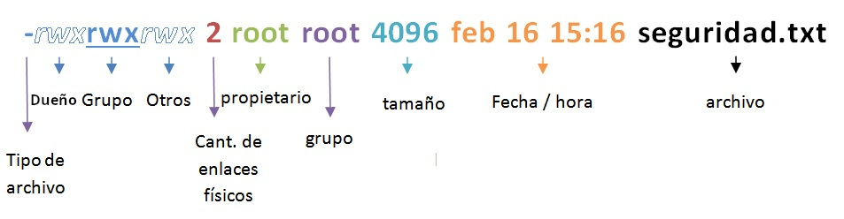
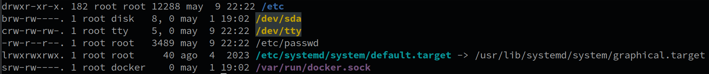
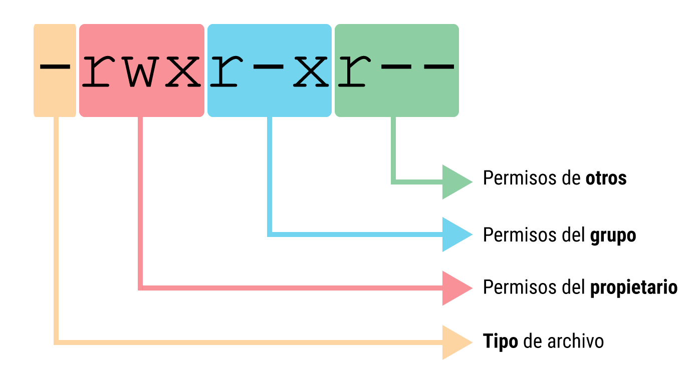
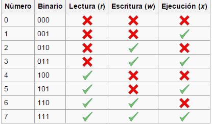
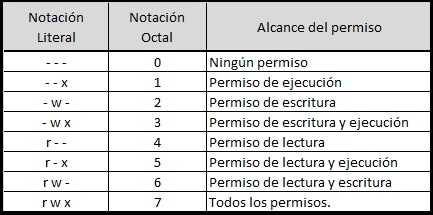
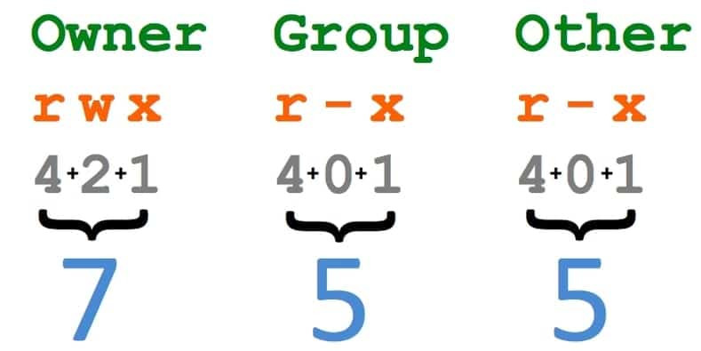

# Owner y Permisos

## Propietarios de los archivos.

En Linux, cada archivo y directorio tiene un propietario y un grupo asociados. 

### Cambiar el Propietario y el Grupo con `chown`

El comando `chown` permite cambiar estos atributos. La sintaxis básica es:

- Para cambiar solo el propietario, simplemente especifica el nombre del usuario:
- Para cambiar tanto el propietario como el grupo, usa el formato `propietario:grupo`:
- Para cambiar solo el grupo, puedes usar `chown` con dos puntos al inicio o usar el comando `chgrp`:
- Cambiar el propietario y el grupo de todos los archivos y subdirectorios recursivamente: `chown -R` 

## Permisos en GNU/Linux
En Linux, cada archivo y directorio tiene un conjunto de permisos que determinan quién puede hacer qué con esos recursos. 
Estos permisos se dividen en tres partes: para el propietario (usuario), el grupo y otros usuarios (otros). 
Pero además del permiso en sí, el primer carácter de un listado de permisos indica el tipo de archivo o permisos especiales.

Usando el comando `ls -l`, verás algo como esto:

<table>
   <tr>
      <td></td>
   </tr>
</table>

### Tipos de Archivos y Permisos Especiales

El primer carácter indica el tipo de archivo:

- **d**: Directorio.
- **-**: Archivo regular.
- **l**: Enlace simbólico (soft link).
- **c**: Archivo de dispositivo de carácter.
- **b**: Archivo de dispositivo de bloque.
- **p**: Tubería (pipe).
- **s**: Socket.

<table>
   <tr>
      <td></td>
   </tr>
</table>

### Permisos Estándares

Los permisos estándar se dividen en tres grupos: propietario, grupo y otros, cada uno con tres permisos posibles:

- **r** para lectura (read).
- **w** para escritura (write).
- **x** para ejecución (execute).

Los permisos se representan de forma simbólica como un conjunto de 10 caracteres. Los primeros 9 caracteres indican los permisos para el propietario, el grupo y otros. 

<table>
   <tr>
      <td></td>
   </tr>
</table>

En el ejemplo de la imagen de arriba:
- **rwx** (propietario): Puede leer, escribir y ejecutar.
- **r-x** (grupo): Puede leer y ejecutar.
- **r--** (otros): Solo pueden leer.

### Cambiar Permisos

Para cambiar los permisos de un archivo o directorio, se utiliza el comando `chmod`. Puedes usar tanto la notación simbólica como la octal para indicar qué permisos modificar:

- **Notación simbólica**: Usa letras para definir qué permisos cambiar. Ejemplo: `chmod u+x archivo` agrega el permiso de ejecución para el propietario.
- **Notación octal**: Utiliza valores numéricos para representar permisos. Ejemplo: `chmod 755 archivo` permite al propietario leer, escribir y ejecutar, y al grupo y a otros solo leer y ejecutar.

#### Nosotros nos centraremos en la Notacion Octal, que es la mas utilizada.
> Cada dígito octal puede representar un conjunto de permisos.  
> El sistema octal es adecuado para esto porque cada permiso (lectura, escritura, ejecución) se puede representar como un bit en una secuencia binaria. 
> En el contexto de permisos de archivos, cada dígito octal representa un conjunto de tres bits, que se corresponden con los permisos de lectura, escritura y ejecución, en ese orden. 

Para entender cómo se traduce el sistema binario a la notación octal para permisos de Linux, Veamos los siguientes cuadros:

<table>
   <tr>
      <td></td>
      <td></td>
   </tr>
</table>

La notación octal para permisos de archivos en Linux generalmente consta de tres dígitos, uno para el propietario (usuario), otro para el grupo y otro para otros usuarios:

El primer dígito representa los permisos para el propietario.
El segundo dígito representa los permisos para el grupo.
El tercer dígito representa los permisos para otros usuarios.

<table>
   <tr>
      <td></td>
   </tr>
</table>

De esta forma como vemos en la imagen. para lograr dichos permisos en un archivo deberemos ejecutar el comando `chmod 755 archivo`  
Tambien lo pueden aplicar en forma recursiva con la opcion -R `chmod -R 755 directorio/`  

### Permisos Especiales (Material Extra)

Además de los permisos básicos (RWX), existen permisos especiales conocidos como `setuid`, `setgid`, y `sticky bit`. 

## `setuid` (Set User ID)
- Este permiso especial se indica con una `s` en lugar de la `x` de ejecución en los permisos del propietario.
- Cuando se establece en un archivo ejecutable, cualquier usuario que lo ejecute obtiene los privilegios del propietario del archivo. 
- Por ejemplo, si un ejecutable tiene el `setuid` y el propietario es `root`, cualquier usuario que lo ejecute tendrá privilegios de superusuario durante la ejecución del archivo.

## `setgid` (Set Group ID)
- Este permiso especial se indica con una `s` en lugar de la `x` de ejecución en los permisos del grupo.
- Cuando se establece en un archivo ejecutable, el proceso que se ejecuta hereda el grupo del archivo, independientemente del grupo del usuario que lo ejecute.
- En un directorio, el `setgid` hace que los archivos y subdirectorios creados dentro de él hereden el grupo del directorio, en lugar del grupo primario del usuario que los crea.

## `Sticky Bit`
- Este permiso especial se indica con una `t` al final de los permisos para otros.
- Se utiliza principalmente en directorios como `/tmp` para controlar quién puede eliminar archivos. 
- Con el `sticky bit` activado, solo el propietario del archivo o el superusuario puede eliminar o renombrar archivos, incluso si otros tienen permisos de escritura en el directorio.

## Ejemplos de Uso
- Para agregar el `setuid` a un archivo ejecutable, se usa el comando: `chmod u+s <archivo>`.
- Para agregar el `setgid`, se usa: `chmod g+s <archivo>`.
- Para agregar el `sticky bit`, se usa: `chmod +t <directorio>`.
