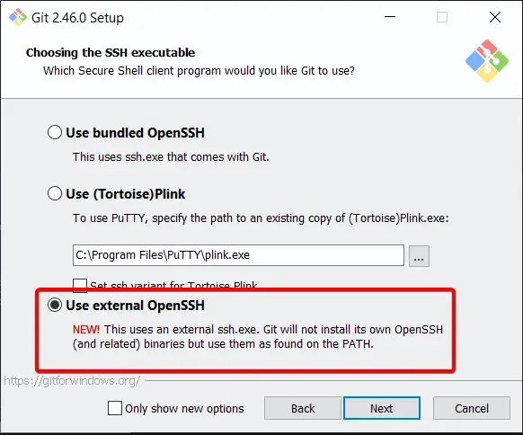
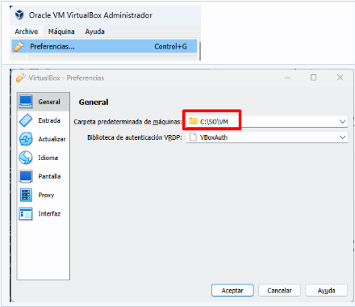

# Preparación del entorno del estudiante: 

   ### Programas que se requieren instalar.
   Indispensables:
   - [ ] git 
      <details>
        <summary>&emsp; <Mostrar/Ocultar> En caso de instalacion Manual, Marcar "Usar External OpenSSH" (Haga Click para ver...) </summary>
      <div>
      <table>
         <tr>
            <td></td>
         </tr>
      </table>
      </div>
      </details>
   - [ ] VirtualBox  
   - [ ] Vagrant   
  
   Opcionales:
   - [ ] Chocolatey
   - [ ] WSL   
   - [ ] MobaXterm
   - [ ] Putty
   - [ ] WinSCP
   - [ ] Docker Desktop
   - [ ] Visual Studio Code / SublimeText

> El estudiante debera tener instalados en su pc los siguientes programas </br>
> La misma se podra realizar de forma tradicional o utilizando chocolatey
   - Instalación vía Chocolatey / PowerShell de:
     - [WSL](https://learn.microsoft.com/es-es/windows/wsl/install)
     - [Chocolatey](https://docs.chocolatey.org/en-us/choco/setup#more-install-options)
       - git
       - VirtualBox
       - virtualbox-guest-additions-guest
       - Vagrant
       - sublimetext4
       - docker-desktop
       - MobaXterm
       - PuTTY
       - PuTTYgen
       - WinSCP
   ```sh
   choco install -y git --params "/NoOpenSSH" sublimetext4 virtualbox virtualbox-guest-additions-guest.install vagrant mobaxterm putty.portable winscp   --log-file=c:\chocolatey_install.log
   ```
   ### Tener Descargadas (Para optimizar tiempos)
   - ISO de instalacion [Descargar_ISO_Fedora-Mate](https://fedoraproject.org/es/spins/mate/download)
   - Disco Rigido Virtual(VDI) con Ubuntu instalado [Descargar-VDI](https://sourceforge.net/projects/osboxes/files/v/vb/55-U-u/24.04/64bit.7z/download)
   > Configura el entorno del estudiante con las herramientas necesarias para el curso.

   ### Habilitar la virtualizacion
  
   - [ ] **Verificar si tu PC (Host) permite y esta Habilitada la Virtualizacion:**
      - Verificacion desde Windows
         - [windows 10](https://learn.microsoft.com/es-es/virtualization/hyper-v-on-windows/reference/hyper-v-requirements) 
         - [windows 11](https://support.microsoft.com/es-es/windows/habilitar-la-virtualizaci%C3%B3n-en-equipos-windows-11-c5578302-6e43-4b4b-a449-8ced115f58e1)
      - Verificacion desde Linux o Terminal de Git-Bash en Windows.
      ```sh
      grep flags  /proc/cpuinfo  |tail -n1  |grep -iE 'smv|vmx'
      ```
      - Verificacion desde la BIOS 
        - Como activar la Virtualizacion 
          - [video](https://www.youtube.com/watch?v=PK0WEbQuzxk)
          - [otro video](https://www.youtube.com/watch?v=zn3ot0MlVhA)
        - [Intel](https://www.intel.la/content/www/xl/es/support/articles/000005486/processors.html)
        - [Multiples marcas](https://hardzone.es/2018/12/06/virtualizacion-cpu-como-activarla-ventajas/)
      > Verificar y Configura la PC para virtualizar equipos.

      - Para los que tienen Mac (M1 o M2)
        - [Multipass](https://reviblog.net/2021/11/13/como-virtualizar-de-manera-gratuita-ubuntu-linux-en-los-mac-con-chip-m1/)

      > Configura la PC (Mac con Microprocesadores M1 o M2) para virtualizar equipos.

   - [ ] Configuracion de VirtualBox
      - Cambiar la carpeta predeterminada donde se alojaran los archivos de las Maquinas Virtuales.
      <div>
      <table>
         <tr>
            <td></td>
         </tr>
      </table>
      </div>
   > Esto evitara problemas de permisos de windows al usar vagrant para gestionar las VMs.  
   

   ### Extras:

   - [ ] Crear un USB Booteable 
     - [ ] Herramientas para crear un USB booteable
       -  [Ventoy](https://www.ventoy.net/en/download.html) **(Recomendado)**
       - [Rufus](https://rufus.ie/es/)
       - [YUMI](https://pendrivelinux.com/yumi-multiboot-usb-creator/)
     - [ ] Aca dejo un video de como [funciona Ventoy](https://www.youtube.com/watch?v=CrCJbN_hi1g)
     - [ ] Nota de como hacer un [dual boot](https://www.xataka.com/basics/como-instalar-linux-a-windows-10-ordenadores)  
     - [ ] Video [Haciendo un dual boot en VirtualBox](https://www.youtube.com/watch?v=Rj9bzqP5egU)
     - [ ] Video [dual boot](https://www.youtube.com/watch?v=Asyp7UTCtXs)
      
      > Estas Herramientas te crearan un USB booteable desde donde Puedes:  
      > - Instalar cualquier Sistema Operativo 
      > - Probar la mayoria de las Distribuciones GNU/Linux. **Sin Necesidad de Instalarlas en tu PC.**


  