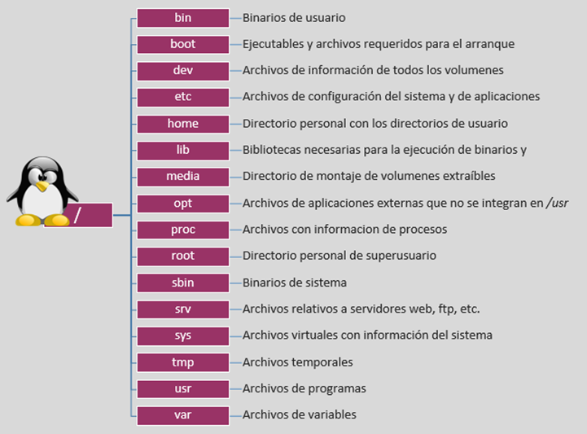

# UTN-FRA_SO_onBording
### Catedra de Arquitectura de Sistemas Operativos - UTN


### Programas que se requieren instalar.

- [ ] Chocolatey
- [ ] WSL
- [ ] git
- [ ] VirtualBox
- [ ] Vagrant
- [ ] MobaXterm
- [ ] Putty
- [ ] WinSCP
- [ ] Docker Desktop
- [ ] Visual Studio Code / SublimeText

### Algunos Repositorios que usaremos durante la cursada

- 
- [Vagrant](https://github.com/upszot/UTN-FRA_SO_Vagrant.git)
- [Examenes](https://github.com/upszot/UTN-FRA_SO_Examenes.git)
- [Bash](https://github.com/upszot/UTN-FRA_SO_Bash.git)
- [Ansible](https://github.com/upszot/UTN-FRA_SO_Ansible.git)
- [pc-workstation](https://github.com/upszot/pc-workstation.git)
- [Docker](https://github.com/upszot/UTN-FRA_SO_Docker.git)


### Distribuciones de GNU/Linux utilizadas.
> En principio el alumno podra utilizar cualquier distribucion de GNU/Linux que desee. </br>
> Nosotros en la cursada vamos a hacer referencia a 2 de las [distros mas usadas](https://distrowatch.com/). </br>
 > Tambien podra elegir el [Entorno de Escritorio](https://es.wikipedia.org/wiki/Entornos_de_Escritorio_en_Linux) que desee ([KDE](https://es.wikipedia.org/wiki/KDE), [GNOME](https://es.wikipedia.org/wiki/GNOME), [Cinnamon](https://es.wikipedia.org/wiki/Cinnamon), [MATE](https://es.wikipedia.org/wiki/MATE) , [Xfce](https://es.wikipedia.org/wiki/Xfce), [Deepin](https://es.wikipedia.org/wiki/Deepin) 

- Nosotros Recomendamos Instalar (Por simplicidad y bajos requerimentos de recursos las siguientes)
  - [Ubuntu](https://ubuntu.com/download/desktop) Recomendamos instalar ultima version de Larga Duracion de Soporte (LTS)
  - [Fedora](https://fedoraproject.org/es/spins/) Recomendamos Instalar Fedora Mate-Compiz
- Levantaremos VM de forma automatizada mediante Vagrant.
- Utilizaremos discos rigidos virtuales con los SO pre-instalados que los pueden bajar de [OSBoxes.org](https://www.osboxes.org/virtualbox-images/)
- Probaremos multiples distribuciones sin necesidad de instalacion mediante un browser en [Distrosea](https://distrosea.com/)
- Correr contenedores de docker desde [play-with-docker](https://labs.play-with-docker.com/) sin necesidad de instalarlo.
- Conocer [kubernetes](https://labs.play-with-k8s.com/) o [Openshift](https://developers.redhat.com/developer-sandbox/activities/learn-kubernetes-using-red-hat-developer-sandbox-openshift) sin necesidad de instalarlo.

### Algunos Temas que aprenderemos durante la cursada.

- [ ] **Preparación del entorno del estudiante: </br>
    (Es deseable que este todo instalado antes de iniciar la cursada)**
   - Instalación vía Chocolatey / PowerShell de:
     - [WSL](https://learn.microsoft.com/es-es/windows/wsl/install)
     - [Chocolatey](https://docs.chocolatey.org/en-us/choco/setup#more-install-options)
       - git
       - sublimetext4
       - VirtualBox
       - virtualbox-guest-additions-guest
       - Vagrant
       - MobaXterm
       - PuTTY
       - PuTTYgen
       - WinSCP
```sh
choco install -y git sublimetext4 virtualbox virtualbox-guest-additions-guest.install vagrant mobaxterm putty.portable winscp   --log-file=c:\chocolatey_install.log
```
   > Configura el entorno del estudiante con las herramientas necesarias para el curso.

- [ ] **Verificar si el Host permite y esta Habilitada la Virtualizacion:**
   - Verificacion desde Windows
      - [windows 10](https://learn.microsoft.com/es-es/virtualization/hyper-v-on-windows/reference/hyper-v-requirements) 
      - [windows 11](https://support.microsoft.com/es-es/windows/habilitar-la-virtualizaci%C3%B3n-en-equipos-windows-11-c5578302-6e43-4b4b-a449-8ced115f58e1)
   - Verificacion desde Linux
   ```sh
   grep flags  /proc/cpuinfo  |tail -n1  |grep -iE 'smv|vmx'
   ```
   - Verificacion desde la BIOS 
     - [Intel](https://www.intel.la/content/www/xl/es/support/articles/000005486/processors.html)
     - [Multiples marcas](https://hardzone.es/2018/12/06/virtualizacion-cpu-como-activarla-ventajas/)
   > Verificar y Configura la PC para virtualizar equipos.


- [ ] **Generación de VM dentro de VirtualBox:**
   - Creacion VM Manualmente VirtualBox [PDF](vm/Creacion-de-la-maquina-virtual.pdf)
   - Creación e instalación de Linux de forma tradicional. [Video](https://www.youtube.com/watch?v=lp5DnhwWt-M)
   - Uso de una imagen de disco descargada de [OSBoxes.org](https://www.osboxes.org/virtualbox-images/).
   - Generación de VM mediante [Vagrant](https://github.com/upszot/UTN-FRA_SO_Vagrant.git).
   > Crea y gestiona máquinas virtuales para propósitos de aprendizaje.

- [ ] **Conexión a las VM:**
   - Terminal de VirtualBox.
   - [SSH](ssh/ssh.md) dentro de PowerShell o gitbash.
   - `vagrant ssh`.
   - Conexión por SSH vía PuTTY o MobaXterm.
   - WinSCP.
   > Conecta y gestiona el acceso a las máquinas virtuales desde diferentes entornos.

- [ ] **Jerarquía de Estructura de Directorio Linux:**
   <details>
     <summary>&emsp; <Mostrar/Ocultar> - Estructura de directorios Linux</summary>
   <div>
   <table>
      <tr>
         <td></td>
      </tr>
   </table>
   </div>
   </details>
   > Explora la estructura de directorios en sistemas Linux.

- [ ] **Algunos archivos de configuracion que veremos:**
   - Configuración del Sistema:
     - `/etc/passwd`: Archivo que almacena información de cuentas de usuario.
     - `/etc/shadow`: Archivo que almacena las contraseñas encriptadas de los usuarios.
     - `/etc/hosts`: Archivo que mapea direcciones IP a nombres de host.
     - `/etc/sudoers`: Archivo que especifica qué usuarios tienen permiso para ejecutar comandos como superusuario.
   - Configuración del Usuario:
     - `$HOME/.ssh/config`: Configuración personalizada para conexiones SSH.
     - `$HOME/.bashrc`: Archivo de configuración de inicio de la shell Bash.
     - `$HOME/.bash_history`: Historial de comandos ejecutados en la shell Bash.
   - Logs del Sistema:
     - `/var/log/messages`: Registro de mensajes del sistema.
   > Explora archivos de configuracion y archivos de usuario comunes en sistemas Linux.

- [ ] **Comandos Básicos - Aprender a moverse por la terminal:**
   - [Documentación y Ayuda](comandos_basicos/man.md):
     - `man`: Mostrar el manual del comando.
     - `apropos`: Buscar comandos por palabra clave.
   - Información del Usuario:
     - `whoami`: Mostrar nombre de usuario.
     - `id`: Mostrar información de usuario y grupo.
   - Navegación:
     - `pwd`: Mostrar ruta del directorio actual.
     - `ls`: Listar contenido del directorio.
     - `cd`: Cambiar directorio.
     - `tree`: Mostrar estructura de directorios en forma de árbol.
   - Manipulación de Archivos y Directorios:
     - `mkdir`: Crear directorios.
     - `rm`: Eliminar archivos o directorios.
     - `touch`: Crear archivos vacíos o actualizar marcas de tiempo.
     - `cp`: Copiar archivos o directorios.
     - `mv`: Mover o renombrar archivos o directorios.
   - Información del Sistema y Sesiones:
     - `w`: Mostrar información sobre los usuarios y sus actividades.
     - `last`: Mostrar historial de inicio de sesión.
   > Desarrolla habilidades fundamentales para la navegación y manipulación de archivos en la terminal, y aprende a acceder a información detallada con `man` y `apropos`.

- [ ] **Atajos para Moverse Dentro de la Terminal:**
   - `Ctrl + E`: Moverse al final de la línea.
   - `Ctrl + A`: Moverse al principio de la línea.
   - `Ctrl + →` y `Ctrl + ←`: Saltar de palabra en palabra hacia adelante y hacia atrás, respectivamente.
   - `Ctrl + W`: Eliminar la palabra anterior.
   - `Ctrl + U`: Eliminar desde la posición actual hasta el principio de la línea.
   - `Ctrl + K`: Eliminar desde la posición actual hasta el final de la línea.
   - `Ctrl + T`: Intercambiar las dos letras antes del cursor.
   - `Alt + T`: Intercambiar las dos palabras antes del cursor.
   - `Ctrl + Y`: Pegar texto previamente eliminado.
   > Agiliza tus movimientos dentro de la terminal utilizando estos atajos para navegar y editar comandos con eficiencia.

- [ ] **Atajos para Búsqueda en el Historial:**
   - `history`: Mostrar el historial completo de comandos.
   - `Ctrl + R`: Realizar una búsqueda inversa en el historial de comandos.
   - `!número`: Ejecutar el comando con el número específico en el historial.
   - `!!`: Ejecutar el último comando.
   - `sudo !!`: Ejecutar el último comando con privilegios de superusuario.
   > Facilita la búsqueda de comandos anteriores en la historia de la terminal y agiliza la ejecución con estos atajos específicos.

- [ ] **Obtención y Filtrado de Información:**
   - `cat`, `grep`, `tail`, `head`.
   > Aprende a extraer y filtrar información de archivos y flujos de datos.

- [ ] **Uso básico de VIM:**
   - [Atajos vim](vim/vim.md) 
   - [Seteos vim](vim/.vimrc)
   - [cheat sheet](vim/cheat_sheet_Imprimible.pdf)
   - [cheat sheet Tutorial](vim/vim_cheat_sheet_tutorial.pdf)
   - [Video 11' Atajos vim del @PeladoNerd](https://www.youtube.com/watch?v=TmNa4y-K5Z8)
   > Introducción al editor de texto VIM para la edición de archivos en la terminal.

- [ ] **[Redireccionamiento y Tuberías:](comandos_basicos/Redireccionamiento_tuberias.md)**
   -  `>`, `>>`, `<<<`,`<<`, `<`, `<< DELIMITADOR > archivo`, 
   - `stdout`, `stdin`, `stderr`.
   - |
   > Comprende y utiliza redireccionamientos y tuberías en la terminal.

- [ ] **Tuneando tu Terminal:**
   - [ ] **Tunenado el History:**
      - `echo "HISTSIZE=-1" >> ~/.bashrc`: Configurar el historial para guardar comandos indefinidamente.
      - `echo "export HISTCONTROL=\$HISTCONTROL:ignoreboth" >> ~/.bashrc`: Configurar el historial para ignorar comandos duplicados y espacios en blanco consecutivos.
      - `echo "history -a" >> ~/.bashrc`: Automatizar la sincronización del historial al ejecutar un comando.

      > Mejora la gestión y persistencia del historial para un trabajo más eficiente.

   - [ ] **Agregando Alias:**
      - `mkdir -p ~/aliases.d && echo "export PATH=\$PATH:~/aliases.d" >> ~/.bashrc`: Crear la carpeta `aliases.d` y agregarla al `PATH`.
      - `echo "alias saludo='cowsay Hola \$(whoami)'" >> ~/aliases.d/saludo`: Crear un alias "saludo" que muestra un saludo personalizado usando COWSAY.
      - `echo "alias history-top='history | awk '{CMD[\$2]++;count++;}END { for (a in CMD)print CMD[a] " " CMD[a]/count*100 "% " a;}' | grep -v "./" | column -c3 -s " " -t | sort -nr | nl | head -n10'" >> ~/aliases.d/history-top`: Crear un alias "history-top" que muestra los 10 comandos más utilizados.

      > Organiza tus alias en una carpeta dedicada y mejora la legibilidad y mantenimiento de tu entorno.


- [ ] **Algunos Comandos Avanzados:**
   - `awk`, `xargs`, `visudo`.
   > Explora comandos avanzados para el procesamiento de texto y la administración del sistema.

- [ ] **Manejo de Paquetes y Búsqueda de Archivos:**
   - Debian y Derivados (apt):
     - `apt update`: Actualizar la lista de paquetes disponibles.
     - `apt search`: Buscar paquetes.
     - `apt install`: Instalar paquetes.
     - `apt upgrade`: Actualizar paquetes instalados a las versiones más recientes.
     - `apt show`: Mostrar información detallada de un paquete, incluyendo proveedores.
     - Agregar Repositorios en Debian y Derivados.
       > Configura y añade repositorios adicionales para acceder a más paquetes.

   - RedHat y Derivados (dnf):
     - `dnf search`: Buscar paquetes.
     - `dnf update`: Actualizar paquetes instalados.
     - `dnf providers`: Mostrar proveedores de un paquete.
     - Agregar Repositorios en RedHat y Derivados.
       > Configura y añade repositorios adicionales para acceder a más paquetes.
   
   - Búsqueda y Localización de Archivos:
     - `locate`: Buscar archivos o directorios en la base de datos del sistema.
     - `updatedb`: Actualizar la base de datos de `locate`.
     - `whereis`: Mostrar ubicaciones de archivos binarios, fuentes y páginas de manuales.
     - `whatis`: Mostrar descripción breve de un comando.
       
   > Aprende a gestionar paquetes, actualizar listas, buscar, instalar y configurar repositorios, así como a buscar archivos en sistemas Debian y RedHat.


- [ ] **Creación de Usuarios y Grupos:**
   - `useradd`, `groupadd`, `usermod`, `id`.
   - Archivos de configuración relacionados:
     - `/etc/passwd`: Contiene información de cuentas de usuario.
     - `/etc/shadow`: Almacena contraseñas cifradas.
     - `/etc/group`: Información de grupos de usuarios.
   > Gestiona usuarios y grupos en el sistema y explora los archivos de configuración asociados para entender su funcionamiento.


- [ ] **Permisos:**
   - `chmod`.
   > Asigna permisos a archivos y directorios.

- [ ] **Particionamiento, Formateo y Montado:**
   - `dmesg`, `fdisk`, `mkfs.ext4`, `df`, `lsblk`.
   - `/etc/fstab`, `mount`, `umount`.
   > Trabaja con particiones, formateo y montado de sistemas de archivos.

- [ ] **LVM (Logical Volume Management):**
   - `pvcreate`, `vgcreate`, `lvcreate`, `vgextend`, `lvextend`.
   - `resize2fs`, `lvremove`, `vgremove`, `pcremove`.
   > Gestiona volúmenes lógicos para una administración de almacenamiento más flexible.

- [ ] **Memoria Swap:**
   - `free`, `mkswap`, `swapon`, `swapoff`.
   > Configura y gestiona la memoria swap del sistema.

- [ ] **Procesos:**
   - `ps`, `top`.
   - Procesos en segundo nivel.
   > Monitorea y gestiona procesos en el sistema.

- [ ] **Bash Scripting:**
   - `if`, `for`, `while`.
   - Variables.
   > Automatiza tareas mediante scripts Bash.

- [ ] **Manejo de Servicios con Systemctl:**
   > Controla y gestiona servicios del sistema.

- [ ] **Protocolo SSH:**
   - `ssh-keygen`, `ssh-copyid`.
   > Configura y utiliza el protocolo SSH de forma segura.

- [ ] **Aprovisionamiento y Configuración mediante Ansible:**
   > Automatiza la configuración y aprovisionamiento de sistemas.

- [ ] **Docker:**
   > Introducción a la virtualización de contenedores con Docker.

- [ ] **Herramienta de Redes:**
   - `curl`, `wget`, `nmap`, `nc`, `telnet`.
   - `ip`, `ifconfig`.
   > Explora herramientas de red para diagnóstico y configuración.

- [ ] **Protocolo HTTP:**
   - `curl -X GET / POST..`
   > Trabaja con el protocolo HTTP para realizar solicitudes y enviar datos.

- [ ] **Kubernetes (Deseable):**
   > Conceptos básicos de Kubernetes, si el tiempo y el interés lo permiten.

