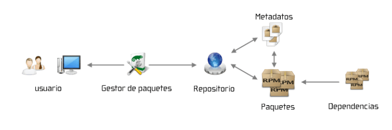

# Manejo de Repositorios 

## ¿Qué es un repositorio de Linux?

> Un repositorio en Linux es una colección de software almacenada en un servidor remoto, desde el cual los usuarios pueden descargar e instalar paquetes de software. Los repositorios contienen paquetes precompilados y sus correspondientes metadatos, que incluyen información sobre el paquete, su versión, dependencias y más.

<div>
<table>
   <tr>
      <td></td>
   </tr>
</table>
</div>

- [ ] **Ventajas y Desventajas de usar un Repositorio**
  - Ventajas:
    - **Facilidad de instalación y actualización**: Permiten instalar y actualizar software fácilmente con comandos simples.
    - **Seguridad**: Los paquetes en repositorios oficiales son verificados y mantenidos por la comunidad o la entidad que mantiene la distribución.
    - **Consistencia**: Los paquetes están probados para trabajar juntos en el entorno de la distribución.
  - Desventajas:
    - **Limitaciones de software**: Los repositorios oficiales pueden no tener la última versión de algunos programas.
    - **Dependencia de conexión a Internet**: Necesario para descargar y actualizar paquetes.
    - **Posibles incompatibilidades**: En ocasiones, pueden surgir problemas de dependencia si se utilizan repositorios externos no oficiales.


## Manejo de Repositorios
- [ ] **Cómo agregar un repositorio**
  - **Debian y Derivados**
    ```sh
    echo "deb http://example-repo-url/ubuntu focal main" >> /etc/apt/sources.list.d/example-repo.list

    sudo apt update
    ```
  - **RedHat y Derivados**
    ```sh
    # Agregar un repositorio de una URL.repo
    sudo dnf config-manager --add-repo <URL-del-repositorio>

    # Agregar manualmente un repositorio
    sudo tee /etc/yum.repos.d/example.repo << FIN

    [example-repo]
    name=Example Repository
    baseurl=http://example-repo-url/fedora/$releasever/$basearch/
    enabled=1
    gpgcheck=1
    gpgkey=http://example-repo-url/RPM-GPG-KEY-example

    FIN
    ```

- [ ] **Habilitar y deshabilitar repositorios**
  - **Debian y Derivados**
    ```sh
    # Habilitar un repositorio (Asegurarse que NO esté comentada la línea)
    sudo sed -i 's/^#deb/deb/' /etc/apt/sources.list.d/repo-ejemplo.list

    # Deshabilitar un repositorio (Asegurarse que ESTÉ comentada la línea)
    sudo sed -i 's/^deb/#deb/' /etc/apt/sources.list.d/repo-ejemplo.list
    ```
  - **RedHat y Derivados**
    ```sh
    # Para ver ID y Nombre de los repositorios
    sudo dnf repolist

    # Habilitar un repositorio
    sudo dnf config-manager --set-enabled <repo-id>

    # Deshabilitar un repositorio
    sudo dnf config-manager --set-disabled <repo-id>
    ```


- [ ] **Encontrar los mirrors de repositorios con menor latencia**
  - **Debian y Derivados**
    ```sh
    sudo apt install netselect-apt
    sudo netselect-apt
    ```
  - **RedHat y Derivados**
    ```sh
    sudo dnf install dnf-plugins-core
    sudo dnf config-manager --setopt=fastestmirror=True --save
    ```


## Verificación de Firma de Paquetes y Certificados

- [ ] **Firma de Paquetes y Certificados**
  > Los paquetes en los repositorios de software a menudo están firmados digitalmente para garantizar su integridad y autenticidad. Estas firmas son verificadas utilizando certificados de clave pública.
  > Cada distribución de Linux tiene sus propios mecanismos para gestionar los certificados y verificar las firmas de los paquetes.

- [ ] **Verificación de Firmas de Paquetes**
  > Una vez que los certificados están instalados, el gestor de paquetes los utiliza automáticamente para verificar la firma de cada paquete descargado.
  > Si la firma del paquete no coincide con la firma verificada usando el certificado, el gestor de paquetes mostrará una advertencia o rechazará la instalación del paquete.

- [ ] **Instalación de Certificados**
  - **Debian y Derivados**
    ```sh
    # Instalar el certificado de clave pública del repositorio
    sudo apt-key adv --fetch-keys http://example-repo-url/KEY.gpg
    ```
  - **RedHat y Derivados**
    ```sh
    # Descargar e importar el certificado de clave pública del repositorio
    sudo dnf install http://example-repo-url/RPM-GPG-KEY-example
    ```
