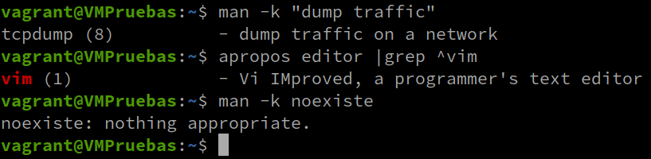
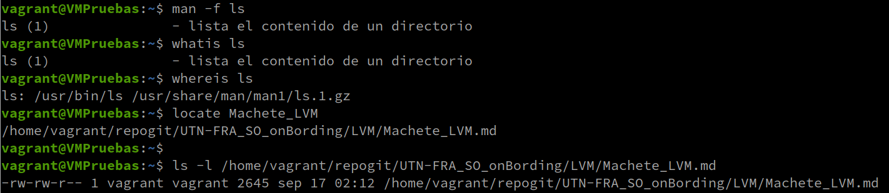

# Comandos Basicos

## man  (interfaz de los manuales de referencia del sistema)

- [ ] **Secciones de las manpages**
<div>
<table>
   <tr>
      <td></td>
   </tr>
</table>
</div>

- [ ] **Ejemplos de  distintas secciones de man**
```sh
# Seccion 1   Programas ejecutables u órdenes de la shell 
man man
man passwd

# Seccion 2   Llamadas al sistema (funciones proporcionadas por el núcleo)
man open

# Seccion 3   Llamadas a biblioteca (funciones dentro de bibliotecas de programa)
man stdio
man shadow

# Seccion 4   Archivos especiales (normalmente se encuentran en /dev)
man tty
man null

# Seccion 5   Formatos de archivo y convenios, p.e.  /etc/passwd
man 5 passwd
man 5 shadow

# Seccion 6   Juegos
man 6 fortune

# Seccion 7   Miscelánea (incluidos paquetes de macros y convenios), p.e. man(7), groff(7), man-pages(7)
man ascii

# Seccion 8   Órdenes de administración del sistema (normalmente solo para root)
man sudo

# Seccion 9   Rutinas del núcleo [No estándar]
man kmalloc
# https://manpages.debian.org/jessie/linux-manual-3.16/kmalloc.9.en.html
```


- [ ] **Configurar manpage en español Argentina**
  - **Debian y Derivados**
    ```sh
      sudo apt update
      sudo apt install -y manpages-es
      sudo localectl set-locale LANG=es_AR.UTF-8
    ```
  - **RedHat y Derivados**
    ```sh
      sudo dnf install -y manpages-es
      sudo localectl set-locale LANG=es_AR.UTF-8
    ```
> Para que tome el cambio, debe re-logearse al equipo


- [ ] **Una forma de buscar un comando, sin conocerlo**
<div>
<table>
   <tr>
      <td></td>
   </tr>
</table>
</div>

```sh
# Por ejemplo si queremos buscar todos los comandos relacionados con la red
man -k network
apropos network

# Tambien podemos aprovechar las tuberias para ir aplicando filtros a la busqueda.
apropos "network devices" |grep ip
```
> Si no trae nada pruebe de actualizar la mandb con el comando "sudo mandb -c" tambien puede ejecutar "updatedb" para actualizar las locate


## **Buscar Informacion sobre un comando especifico**
<div>
<table>
   <tr>
      <td></td>
   </tr>
</table>
</div>

```sh
# El comando `whatis` o `man -f ` muestra una breve descripción de un comando.
whatis ls
man -f ls

# El comando `whereis` muestra las ubicaciones de los binarios, fuentes y páginas de manual para un comando.
whereis ls

#  El comando `locate` Busca archivos en el sistema utilizando la base de datos actualizada por updatedb (instalar plocate).
locate filename


```
> Si no trae nada pruebe de actualizar la mandb con el comando "sudo mandb -c" tambien puede ejecutar "updatedb" para actualizar las locate


